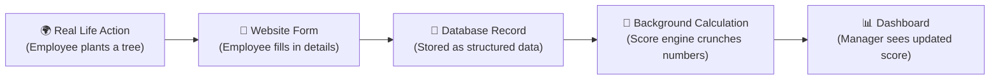

# From Real Life → Website → Calculations

This document answers: **"What does an employee actually type into the website, and how does that turn into an ESG score?"**

---

## The Big Picture



---

## 1. Environmental Module — Carbon Tracking

### Real Life Example
> *"Our delivery fleet drove 500 km last week using diesel trucks."*

### What the Employee Enters on the Website

| Form Field | Type | Example Value | DB Column | Why We Need It |
|---|---|---|---|---|
| Activity Type | Dropdown | `Fleet / Travel` | `activity_type` (ENUM) | Decides which Emission Factor to look up |
| Fuel Type | Dropdown | `Diesel` | `fuel_type` (ENUM) | Different fuels = different carbon output |
| Quantity | Number Input | `500` | `quantity` (DECIMAL) | The raw measurement |
| Unit | Auto-filled | `km` | `unit` (ENUM) | Tied to activity type, prevents user error |
| Date of Activity | Date Picker | `2026-07-10` | `activity_date` (DATE) | For monthly/quarterly reporting |
| Supporting Document | File Upload | `fuel_receipt.pdf` | `proof_url` (VARCHAR) | Audit trail — proof it actually happened |
| Notes | Text Area | `Weekly delivery route` | `notes` (TEXT) | Optional context |

### How the Calculation Works

```
                  Employee Enters              Admin Pre-Configured
                  ┌──────────┐                ┌──────────────────┐
                  │ Quantity  │                │ Emission Factor  │
                  │  = 500   │                │  = 0.27 kg CO₂   │
                  │  (km)    │                │  per km (diesel)  │
                  └────┬─────┘                └────────┬─────────┘
                       │                               │
                       └───────────┬───────────────────┘
                                   │
                                   ▼
                        500 × 0.27 = 135 kg CO₂
                                   │
                                   ▼
                    ┌──────────────────────────────┐
                    │  CarbonTransaction Record    │
                    │  carbon_emitted = 135.00     │
                    │  scope = Scope 1             │
                    │  status = auto_calculated    │
                    └──────────────────────────────┘
```

> [!IMPORTANT]
> The employee **never** calculates or enters carbon kg themselves. They just log what they did (drove 500 km with diesel). The system does the math automatically using the `EmissionFactor` table that the Admin pre-configures.

---

## 2. Social Module — CSR Activities

### Real Life Example
> *"I volunteered at a tree-planting drive organized by my company for 4 hours."*

### What the Employee Enters on the Website

| Form Field | Type | Example Value | DB Column | Why We Need It |
|---|---|---|---|---|
| Activity | Dropdown (from DB) | `Tree Planting Drive 2026` | `csr_activity_id` (FK) | Links to the admin-created activity |
| Hours Contributed | Number Input | `4` | `hours_contributed` (DECIMAL) | Quantifies the effort |
| Role | Dropdown | `Volunteer / Organizer` | `role` (ENUM) | Organizers may get more XP |
| Proof of Participation | File Upload | `selfie_at_event.jpg` | `proof_url` (VARCHAR) | Manager verifies before approving |
| Comments | Text Area | `Planted 12 saplings` | `comments` (TEXT) | Optional |

### How the Calculation Works

```
  Employee Submits Participation
            │
            ▼
  Status = "PENDING" (saved to DB)
            │
            ▼
  Manager Reviews & Approves ✅
            │
            ├──► Social Score += weighted value of activity
            │     (e.g., 4 hours × 5 points/hour = 20 points)
            │
            └──► Gamification Engine
                  ├── XP += 20
                  ├── Check Badge Rules:
                  │     "first_csr" badge → unlocked? ✅
                  │     "50_hours_total" badge → not yet ❌
                  └── Update Leaderboard position
```

> [!TIP]
> Notice the **approval gate**. An employee can't just spam "I did 100 hours" and inflate scores. A manager must verify the proof and approve it first. Only *approved* records count toward scores.

---

## 3. Governance Module — Policy Compliance

### Real Life Example
> *"HR published a new Anti-Bribery Policy v2.0. All employees must read and acknowledge it."*

### What the Employee Sees & Does on the Website

| Action | Type | What Happens | DB Column |
|---|---|---|---|
| View Policy Document | Read-only PDF/HTML | Employee reads the full policy | — |
| Checkbox: "I have read and understood" | Checkbox | Must be checked to proceed | — |
| Digital Signature / Acknowledge | Button Click | Creates a timestamped record | `acknowledged_at` (TIMESTAMP) |
| Policy Version | Auto-filled | `v2.0` | `policy_version` (VARCHAR) |

### How the Calculation Works

```
  Total Employees in Dept = 50
  Employees who acknowledged Policy v2.0 = 45
  
  Policy Compliance Rate = 45 / 50 = 90%
  
  ┌─────────────────────────────────────────────┐
  │  Governance Score Inputs:                   │
  │                                             │
  │  • Policy Compliance Rate     = 90%  ──┐    │
  │  • Open Compliance Issues     = 2    ──┤    │
  │  • Overdue Issues             = 0    ──┤    │
  │  • Audit Findings Resolved    = 95%  ──┘    │
  │                                    │        │
  │                    Weighted Average ▼        │
  │              Governance Score = 87.5         │
  └─────────────────────────────────────────────┘
```

---

## 4. Final ESG Score Rollup

Now all three pillar scores combine:

```
  ┌─────────────────────────────────────────────────────────┐
  │                                                         │
  │  Environmental Score (from carbon data)    = 72         │
  │  Social Score (from CSR participation)     = 85         │
  │  Governance Score (from compliance data)   = 87.5       │
  │                                                         │
  │  Admin-Configured Weights:                              │
  │    Environmental = 40%                                  │
  │    Social        = 30%                                  │
  │    Governance    = 30%                                  │
  │                                                         │
  │  ─────────────────────────────────────────              │
  │  Total = (72 × 0.40) + (85 × 0.30) + (87.5 × 0.30)    │
  │        =   28.8      +   25.5      +   26.25           │
  │        =   80.55                                        │
  │                                                         │
  │  Department ESG Score = 80.55 / 100                     │
  └─────────────────────────────────────────────────────────┘
```

---

## Summary: Who Enters What?

| Role | What They Enter | Where It Goes |
|---|---|---|
| **Employee** | Fuel logs, travel records, CSR participation, policy acknowledgements | Transactional tables (pending approval) |
| **Manager / Dept Head** | Approves/rejects employee submissions, logs compliance issues, sets goals | Status updates, ComplianceIssue table |
| **Admin** | Emission factors, scoring weights, badge rules, CSR activity definitions, policies | Master/configuration tables |

> [!NOTE]
> **The key insight**: Employees only enter **real-world facts** (I drove 500 km, I volunteered 4 hours, I read the policy). They never touch scores, weights, or calculations. The system handles all the math behind the scenes using admin-configured rules.
