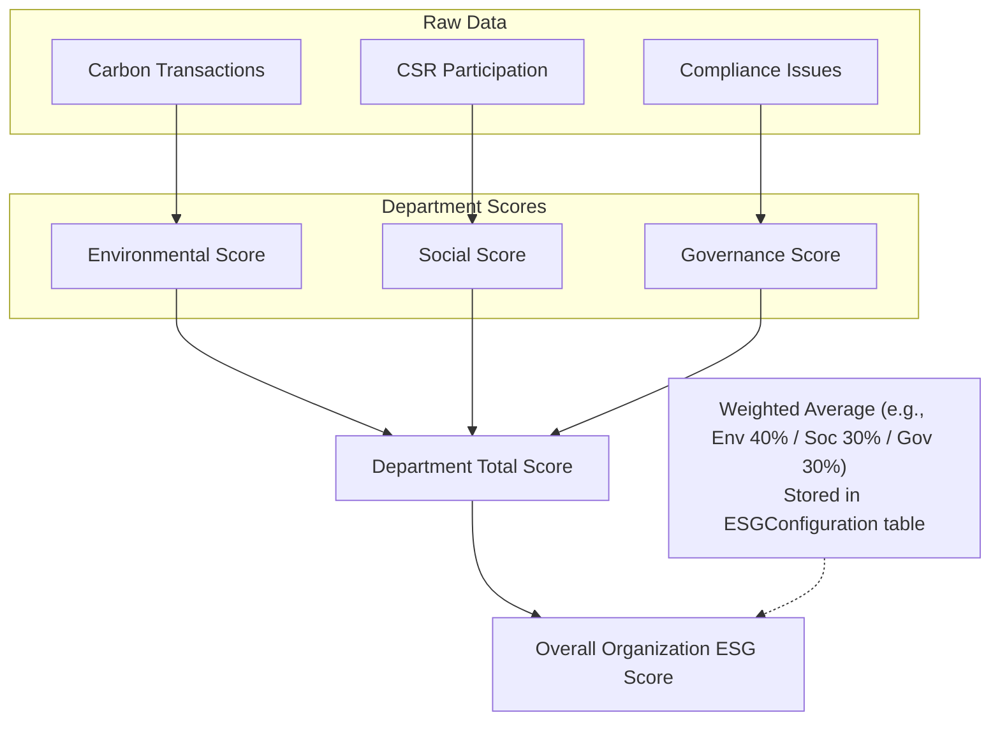

# Data Model & Calculations Guide

As we build the backend, it's crucial to understand the specific attributes of our entities and how the system calculates the scores and triggers automation. Here is a breakdown based on our technical specification.

## 1. Core Entity Attributes & Constraints

We divide our data into **Master Data** (configuration, hierarchy) and **Transactional Data** (events, records).

### Master Data
- **`Department`**: Contains a self-referential relation to support hierarchical structures (Parent Department).
- **`Category`**: Uses a strongly-typed enum (`CSR_ACTIVITY`, `CHALLENGE`) instead of free text to ensure database-level validation.
- **`EmissionFactor`**: The multiplication value for carbon math. Crucially, this must be a `Numeric(precision, scale)` column, *never a float*, to prevent rounding drift.
- **`ESGPolicy`**: Versioned. When an employee signs a policy, the system links it to a specific `version/effective-date`.
- **`Badge`**: The logic for unlocking badges is not hardcoded. It is stored as a `JSONB` column named `Unlock Rule` (e.g., `{"type": "xp_threshold", "value": 500}`).
- **`Reward`**: Includes an inventory `Stock` integer with a database-level constraint (`stock >= 0`) to prevent race conditions where two users buy the last item simultaneously.

### Transactional Data
- **`CarbonTransaction`**: Links to an `EmissionFactor` and the original record (like an expense or fleet log).
- **`EmployeeParticipation`**: Tracks involvement in CSR activities. It has an `Approval Status` (Pending/Approved/Rejected) and an optional `Proof file` reference (enforced conditionally by the Service layer).
- **`Challenge`**: Uses a strict state machine: `Draft -> Active -> Under Review -> Completed`. It can also move to `Archived` from any active state.
- **`ComplianceIssue`**: Must have an `Owner` and a `Due Date` (enforced as `NOT NULL` in the schema).

---

## 2. Calculation Engines & Flow

The backend relies heavily on **Background Jobs (BullMQ)** so we never block user requests while crunching numbers.

### A. The Score Calculation Chain
ESG Scores are calculated per Department and rolled up to the Organization level. This recalculation is triggered by events (e.g., a new carbon transaction).

*Note: We never live-calculate these on a dashboard view. Background jobs write the final scores to a write-only `DepartmentScore` table and cache them in Redis.*

### B. Auto Emission Calculation
When the organization toggles this setting **ON**:
1. A user logs a `Purchase`, `Expense`, or `Fleet` record.
2. The service emits an event: `record.created`.
3. A background job catches this event, looks up the correct `EmissionFactor`, and does the math:
   `Activity Volume * Emission Factor = Carbon Emitted`.
4. The job writes a new `CarbonTransaction`.

### C. Gamification & XP Math
1. An employee submits proof for a Challenge.
2. A Manager moves the Challenge state to `Completed`.
3. The system awards **XP (Experience Points)**.
4. A background job reads the employee's new XP total and compares it against the `JSONB` rules in the `Badge` table to see if they unlock a new achievement.

> [!TIP]
> **Why do we do it this way?** By making rules like scoring weights (`Env 40%`) and Badge criteria (`xp_threshold`) database-driven rather than hardcoded in our TypeScript files, admins can tweak the platform's behavior without requiring us to deploy new code!
