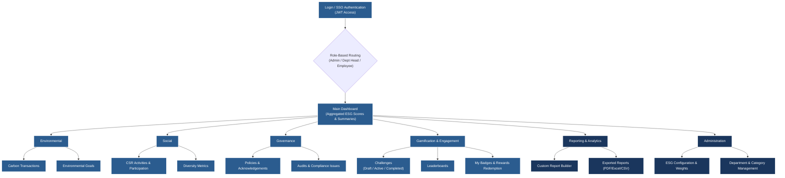

# EcoSphere Project Navigation Flowchart

Based on our system's architecture and the features outlined in the technical specification, here is the frontend navigation flowchart. It's structured similarly to your example, mapping out the main views and how users will navigate through the EcoSphere ESG Management Platform depending on their roles.

### Key Takeaways for the Frontend Layout
- **Blue Boxes**: Accessible by all authenticated employees.
- **Dark Blue Boxes**: Usually restricted to **Admins** and **Department Heads** (e.g., configuring score weights, managing organizational hierarchy, and building custom reports).
- **Gamification**: Is available everywhere. For example, completing a CSR Activity in the "Social" module will automatically update progress in the "Challenges" section and potentially award a Badge behind the scenes.

This matches exactly with the independent domains we mapped out for the backend. Does this high-level view make the project feel a bit more approachable? Let me know, and we can proceed to scaffolding the actual code!
