# EcoSphere ESG Platform Sitemap

This folder contains the sitemap of the EcoSphere ESG Management Platform, illustrating the view hierarchy, form interactions, telemetry updates, and overlays.

## Flowchart Diagram

You can render this diagram using any Markdown viewer that supports Mermaid:

```mermaid
graph TD
    %% Base entry points
    Start([App Entry]) --> Login[Login View #login-view]
    Login -->|Authenticate| AppShell[Enterprise App Shell #app-shell]
    
    %% Shell Layout
    subgraph App Shell Architecture
        AppShell --> Sidebar[Side Navigation Bar]
        AppShell --> Header[Top App Header]
        AppShell --> MainContent[Main Content Canvas]
    end

    %% Sidebar Links & Actions
    subgraph Navigation & Actions
        Sidebar --> NavDashboard[Dashboard tab]
        Sidebar --> NavSust[Sustainability Monitoring tab]
        Sidebar --> NavCompliance[Compliance Reports tab]
        Sidebar --> NavScoring[ESG Scoring tab]
        Sidebar --> NavSettings[Settings tab]
        Sidebar --> ActionGenReport[Generate Report action]
        Sidebar --> ActionLogout[Logout action]
    end

    %% Header Tools
    subgraph Global Header Tools
        Header --> ActionAddData[Add ESG Data button]
        Header --> ActionNotifications[Notifications Bell]
        Header --> ActionProfile[Alex River Profile widget]
        Header --> ActionSearch[Global Search input]
    end

    %% Views & Tabs
    subgraph Tab A: Executive ESG Dashboard
        NavDashboard --> DashPerf[Executive ESG Performance Card]
        NavDashboard --> DashRoadmap[Net Zero 2030 Roadmap Progress]
        NavDashboard --> DashKPIs[Live KPI Grid: Carbon, Water, Energy, Waste]
        NavDashboard --> DashTrends[Sustainability Impact Trends Bar Chart]
        NavDashboard --> DashPillars[Sustainability Pillars E/S/G Rings]
        NavDashboard --> DashScopes[Emissions by Scope progress bars]
        NavDashboard --> DashActivity[Recent Activity Log list]
    end

    subgraph Tab B: Sustainability Monitoring
        NavSust --> SustBento[Bento KPI Grid: Total Emissions, Water, Waste]
        NavSust --> SustTrends[Environmental Impact Trends Monthly/Quarterly]
        NavSust --> SustHealth[Overall ESG Health donut and Rank/Status badges]
        NavSust --> SustTable[Facility Location Breakdown table]
        SustTable --> TableFilter[Filter locations input]
        SustTable --> TableDensity[Toggle Table Density action]
        SustTable --> TableDetails[View details action]
    end

    subgraph Tab C: Compliance Reports
        NavCompliance --> CompNew[Generate New Report button]
        NavCompliance --> CompUpload[Bulk Upload button]
        NavCompliance --> CompCards[Framework cards: BRSR, GRI, TCFD]
        NavCompliance --> CompList[Generated Reports list]
        NavCompliance --> CompPeriod[Reporting Period radio filters]
        NavCompliance --> CompChecklist[Standards checkboxes]
    end

    subgraph Tab D: ESG Scoring Breakdown
        NavScoring --> ScoreE[Environmental - E card - 88%]
        NavScoring --> ScoreS[Social - S card - 72%]
        NavScoring --> ScoreG[Governance - G card - 94%]
    end

    subgraph Tab E: Platform Settings
        NavSettings --> SettingsForm[Configuration Form: Company, Target Year, Baseline]
    end

    %% Overlays & Toast notifications
    subgraph Overlays & Telemetry
        ActionAddData --> ModalAdd[Add ESG Data Modal]
        ActionGenReport --> CompProgress[Processing Data... Progress simulation]
        ModalAdd -->|Submit| TableUpdate[Add to Facility Location table]
        TableUpdate -->|Recalculate| TelemetryUpdate[Update all Dashboard & Sustainability KPIs]
        TableUpdate -->|Trigger Toast| Toast[Toast Notification alerts]
        ActionLogout -->|Return| Login
    end

    %% Styling
    classDef main fill:#006b2c,stroke:#002109,stroke-width:2px,color:#fff;
    classDef layout fill:#0f172a,stroke:#1e293b,stroke-width:2px,color:#fff;
    classDef section fill:#f4fcf0,stroke:#6e7b6c,stroke-width:1px,color:#171d16;
    classDef action fill:#c74668,stroke:#a72d51,stroke-width:1px,color:#fff;
    
    class Start,Login,AppShell main;
    class Sidebar,Header,MainContent layout;
    class NavDashboard,NavSust,NavCompliance,NavScoring,NavSettings section;
    class ActionAddData,ActionGenReport,ActionLogout,ModalAdd,TableUpdate,TelemetryUpdate,Toast action;
```

## Interactive Map

An interactive, responsive HTML visualization of this sitemap is available at [index.html](file:///c:/Odoo/sitemap/index.html). Open it in your web browser to browse the node hierarchy and details.
